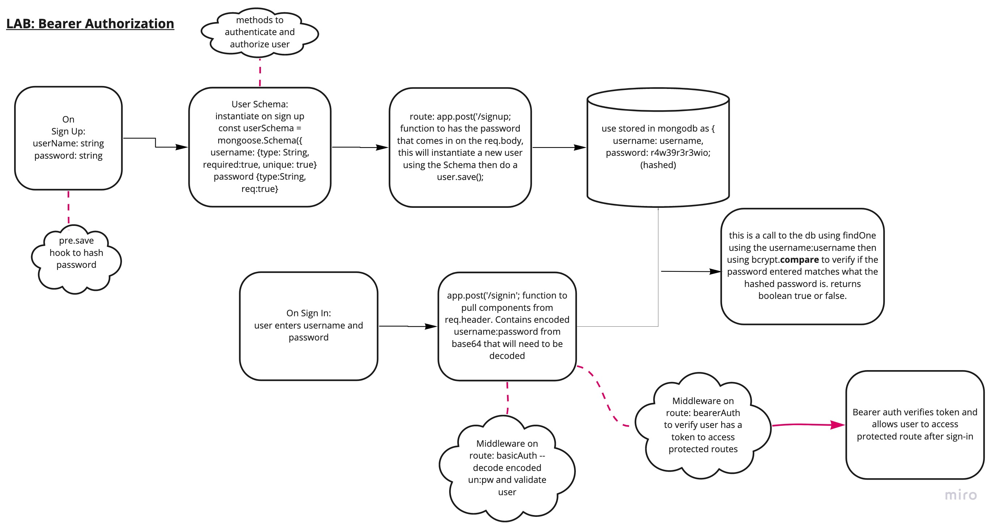

# Lab: Class 06

## Project: bearer-auth

### Author: Audrey Patterson

## Links and Resources

- [Main Branch deployed to heroku](https://audrey-bearer-auth.herokuapp.com/)
- [ci/cd](https://github.com/arpatterson31/bearer-auth/actions)
- [Pull Request dev to main](https://github.com/arpatterson31/bearer-auth/pull/1)

### Setup

#### `.env` requirements (when applicable)

i.e.

- `PORT` - 3333

#### How to initialize/run your application (where applicable)

- e.g. `npm start`

#### Tests

- How do you run tests?
  - run `npm test` in the terminal from root
- Any tests of note?
  - tests are pre-written - just need to make sure they all pass!

#### UML / Application Wiring Diagram

